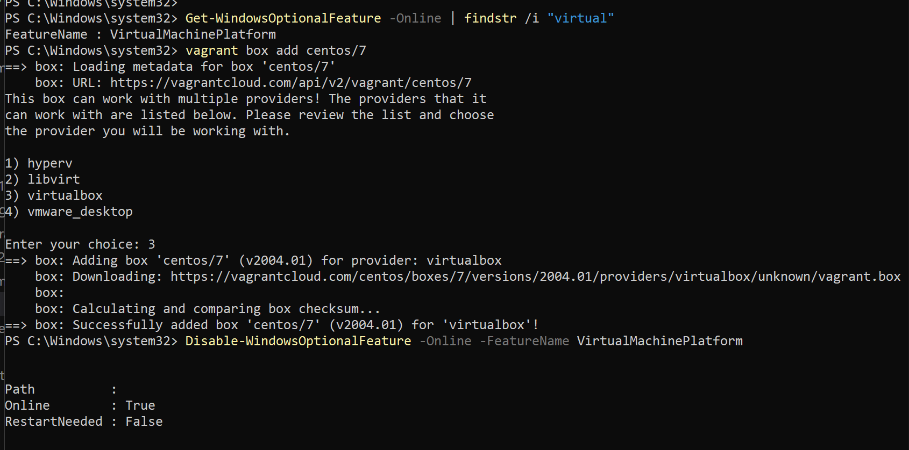
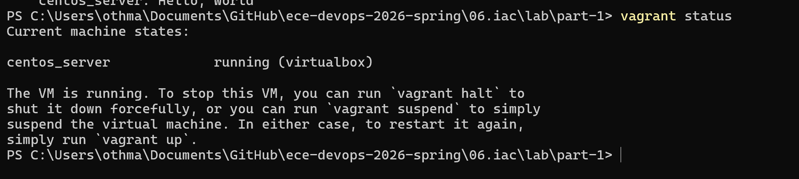
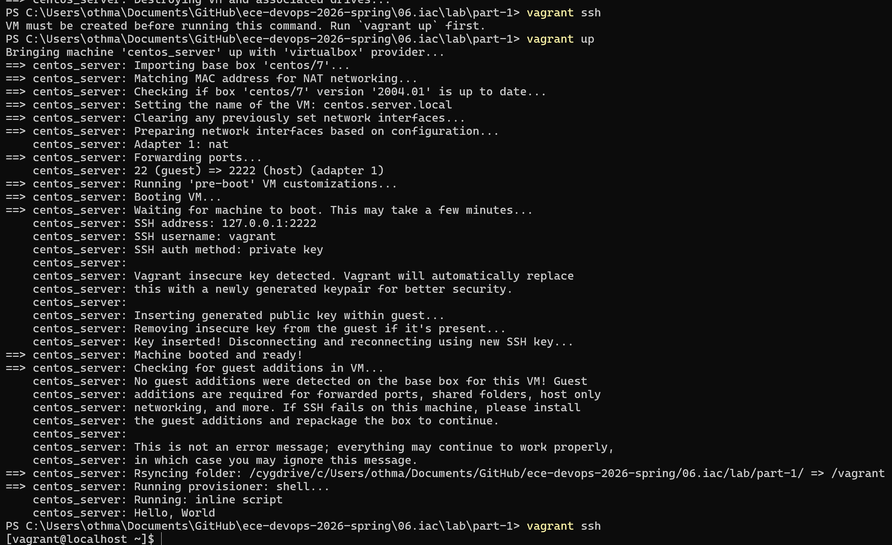
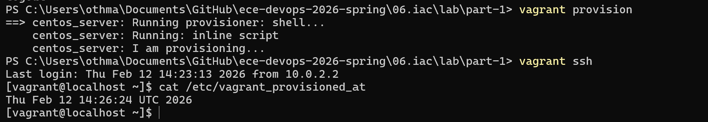
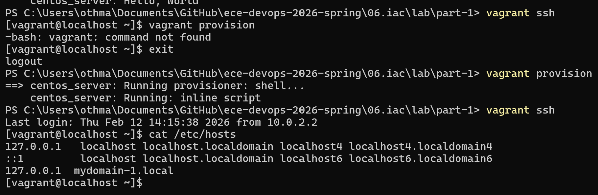
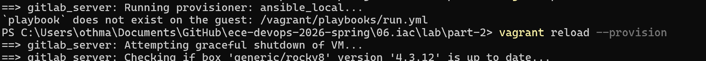
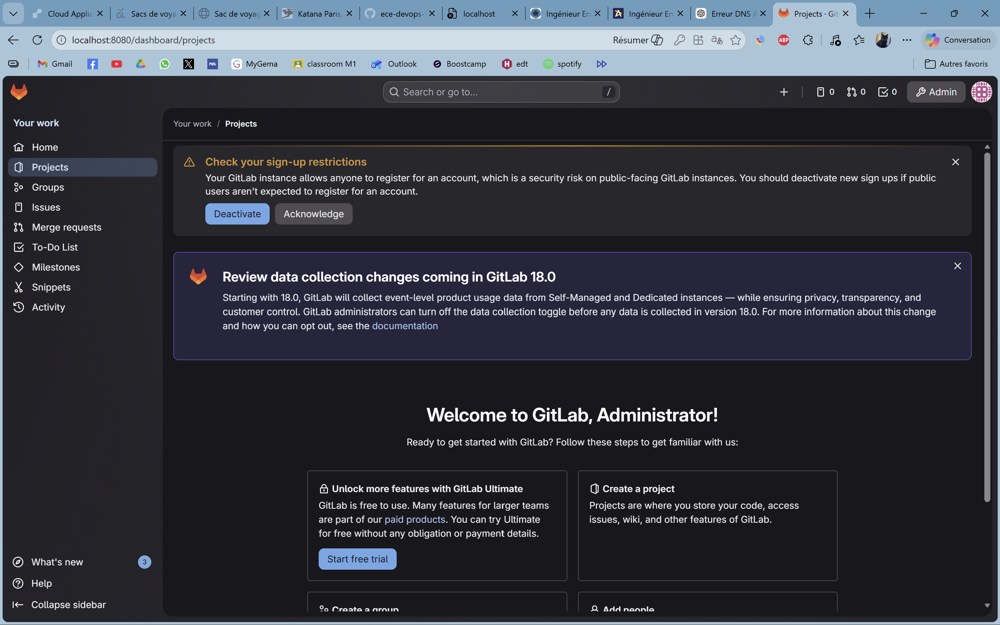
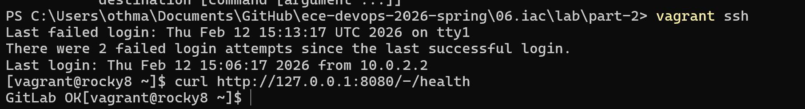
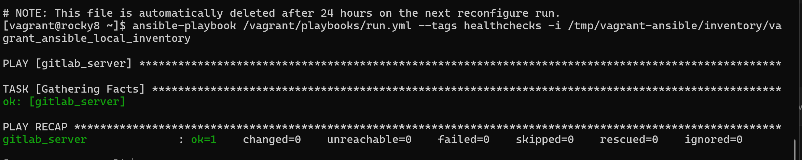

# Compte rendu — Lab IaC (Vagrant, Ansible, GitLab)
## BAN Abdullah et AIFOUTE Othmane
## Objectif du TP
L'objectif de ce laboratoire était de découvrir le principe d'Infrastructure as Code (IaC) en utilisant deux approches :
- une approche **impérative** avec Vagrant + Shell
- une approche **déclarative** avec Vagrant + Ansible pour installer GitLab et vérifier son fonctionnement

---

## Avant de commencer
J'ai installé **VirtualBox** et **Vagrant**, puis téléchargé la box `centos/7`.  
J'ai également dû vérifier la configuration Windows (Hyper-V), car cela peut empêcher VirtualBox de fonctionner correctement.



---

## Partie 1 — Approche impérative (Vagrant + Shell)

### Création de la VM
J'ai utilisé `vagrant up` pour créer la machine virtuelle.  


La VM s'est correctement lancée et j'ai pu vérifier son état avec `vagrant status`.



### Connexion SSH
Je me suis connecté à la VM avec :


```bash
vagrant ssh
```


Cela m'a permis d'exécuter directement des commandes Linux dans la machine virtuelle.




### Provisioning Shell
J'ai modifié le Vagrantfile pour :

- ajouter une entrée dans /etc/hosts

- créer un fichier contenant la date de provisioning

Le provisioning s'exécute avec :
```bash
vagrant provision
```




Observation :
Cette approche est simple mais peu maintenable, car tout est exécuté séquentiellement sans gestion d'état. Si une étape échoue, il faut souvent recommencer.

## Partie 2 — Approche déclarative (Vagrant + Ansible + GitLab)
Création et provisioning
J'ai lancé :
``` bash
vagrant up
```
Cette fois, Vagrant a automatiquement installé Ansible dans la VM Rocky8 et exécuté les playbooks.

Les playbooks installent :

- dépendances système

- configuration réseau et firewall

- Postfix

- GitLab

### Difficultés rencontrées
J'ai rencontré plusieurs problèmes :

- erreur DNS empêchant l'installation de packages (Postfix notamment)

- certains composants n'étaient pas installés correctement

- le localhost:8080 ne fonctionnait pas au début

Le problème venait du fait que la VM ne résolvait pas les noms de domaine (dépôts Rocky Linux inaccessibles).
Après correction du DNS, le provisioning a pu se terminer correctement.



### Test GitLab
Une fois corrigé, j'ai accédé à :
``` bash
http://localhost:8080
```
La page de connexion GitLab est finalement apparue.



Le mot de passe root a été récupéré dans :
``` bash
/etc/gitlab/initial_root_password
```
### Observation :
L'approche déclarative est plus robuste : Ansible décrit l'état attendu du système et réexécute uniquement les actions nécessaires.

## Partie 3 — Health Check GitLab
J'ai exécuté un test de santé directement dans la VM :

``` bash
curl http://127.0.0.1:8080/-/health
``` 

Résultat :



Ensuite, j'ai lancé les health checks via Ansible (readiness et liveness).
Ces vérifications permettent de s'assurer que les services internes (web, base de données, redis…) fonctionnent correctement.




## Conclusion
Ce TP m'a permis de comprendre concrètement la différence entre :

- Impératif : suite de commandes exécutées manuellement (simple mais fragile)

- Déclaratif : description de l'état cible (plus fiable et automatisable)

J'ai également compris l'intérêt de l'IaC pour :

- reproduire un environnement

- automatiser un déploiement serveur

- éviter les erreurs humaines

La partie la plus difficile a été l'installation de GitLab, notamment à cause des problèmes réseau/DNS et du fait que le service web ne répondait pas au début sur localhost.